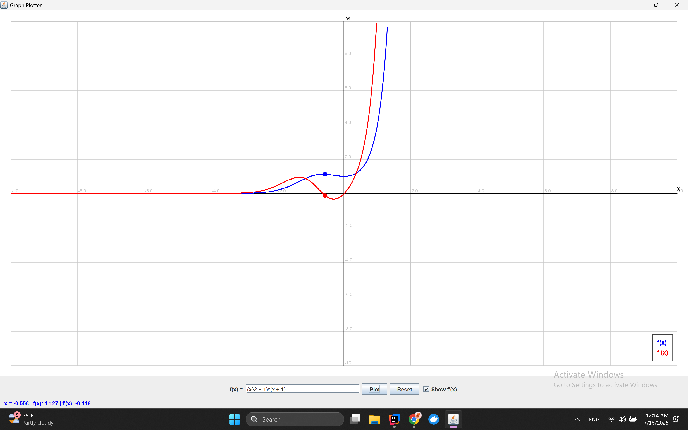

# 📈 Java Function Plotter

A lightweight and powerful Java application to **plot mathematical functions**, visualize their **derivatives**, and handle **complex power expressions**. Built with **Java 21** and **Swing**, this tool provides a clean interface for interactive graphing and real-time value tracking.

---

## 🚀 Features

- ✏️ Input custom functions (supports `^`, `sin`, `cos`, `log`, etc.)
- 📉 Plot complex expressions like `x^(e^2)` or `log(sin(x)^2)^tan(x)`
- 🔺 Option to display the numerical derivative on the same graph
- 🧠 Auto-parses shorthand powers (`x^2` ➝ `pow(x, 2)`) for compatibility
- 🎯 Hover over graph to view live `f(x)` and `f'(x)` values
- 🔍 Zoom and pan for precise function exploration
- ✅ Error handling with status display for invalid input

---

## 🛠 Tech Stack

| Layer         | Technology               |
|---------------|--------------------------|
| Language      | Java 21                  |
| UI Framework  | Swing                    |
| Math Parser   | [exp4j](https://www.objecthunter.net/exp4j/) |
| Build Tool    | Gradle                   |
| Architecture  | MVC Pattern              |
| Derivative    | Central Difference Method|
